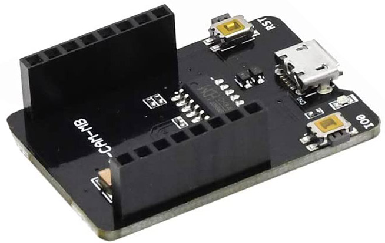

# Update: New version available!
Please take a look at [ESP32CAM-RTSP](https://github.com/rzeldent/esp32cam-rtsp)


# esp32cam-ready


esp32cam-ready combines multiple projects to have an out-the-box solution to use the Chinese (7 Euro!) esp32cam modules.
Easy installation: Flash, provision using the build in configuration webserver and connect!


Flashing this software in esp32cam will make the esp32cam a **webserver** with **streaming data** from the camera and some more features.
Additionally this software hosts a **RTSP server**, that can be used to connect with standard video applications that use RTSP (for example VLC).
RTSP also allows to stream directly to a server using **ffmpeg**. This makes the module a camera server allowing **recording** and  so the stream can be **stored on a disk** and replayed later.

## Required

- esp32cam module
- USB to Serial (TTL level) converter on the piggyback board ESP32-CAM-MB

## Wiring
Only during the upload, the esp32cam module needs to be attached using an USB to serial adapter.


After programming remove the wire to GPIO0 so the module will start normally.

Or, just put the esp32cam module on the ESP32-CAM-MB board and press the IO0 button together with reset and then release the reset button.



## Usage
- Download the repo, open it in [**PlatformIO**](https://platformio.org/) and flash it to the esp32cam.
- The device should become available as an access point with the name esp32cam-xxxxxxxxxxxx, where the xxxxxxxxxxxx represents the MAC address of the device.
The default password for the device as access point is '*esp32cam#*'. 
- Connect to the access point and configure the ssid/password in the browser on on the address [http://192.168.4.1](http://192.168.4.1).
- When the credentials are valid and the device connects to the infrastructure, the device can be accessed over http using the link [http://esp32cam.local](http://esp32cam.local) (or the local ip address) from your browser.

RTSP stream is available at: [rtsp://esp32cam.local:554/mjpeg/1](rtsp://esp32cam.local:554/mjpeg/1). This link can be opened with for example [VLC](https://www.videolan.org/vlc/).

Using the browser, you can
- Take a snapshot
- Stream video
- Turn the light on/off
- Remove the Wifi configuration.

## Installing and running PlatformIO

### Debian based systems command-line
Install platformIO
```
 sudo apt-get install python-pip
 sudo pip install platformio
 pio upgrade
```

### Windows / Linux and Mac
Install [**Visual Studio code**](https://code.visualstudio.com) and install the PlatformIO plugin.
For command line usage Python and PlatformIO-Core is sufficient. More information can be found at: [https://docs.platformio.org/en/latest/installation.html](https://docs.platformio.org/en/latest/installation.html)

Clone this repository, go into the folder and type:
```
 pio run
```
Put a jumper between IO0 and GND, press reset and type:
```
 pio run -t upload
```
When done remove the jumper and press reset. To monitor the output, start a terminal using:
```
 pio device monitor
```

## Credits
esp32cam-ready depends on PlatformIO and Micro-RTSP by Kevin Hester.

Thanks for the community making these tools and libraries available.

Also thanks to EspressIf and the guys that created these modules!
